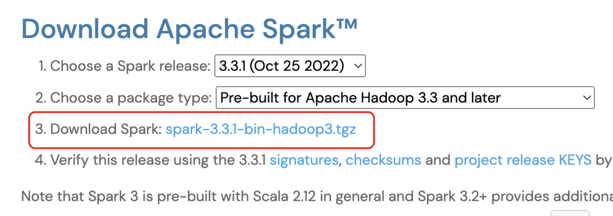
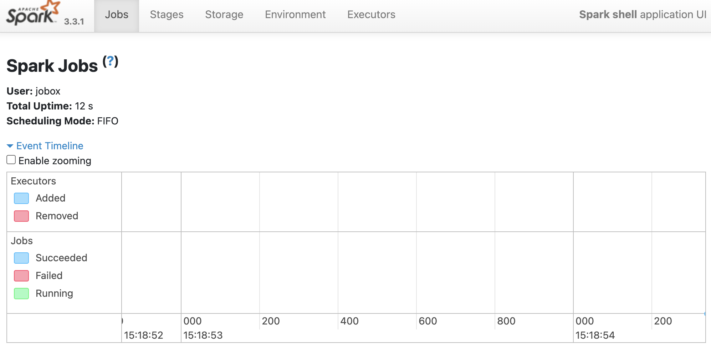

# Mac Z쉘 기준으로 Local Standalone Spark 클러스터 설치

Mac Catalina부터는 Bash 쉘이 아니라 Z쉘이 설치됨

## JDK 확인하고 필요하면 설정

 - JDK8이나 11이나 13이 필요
 - 터미널에서 java -version 명령으로 체크
```
java -version
```
```
java version "11" 2018-09-25
Java(TM) SE Runtime Environment 18.9 (build 11+28)
Java HotSpot(TM) 64-Bit Server VM 18.9 (build 11+28, mixed mode)
```
 - 자바가 없으면 다운로드
   - 오라클에서 Java 8이나 11을 다운로드 아니면 brew를 설치하고 (https://brew.sh 에서 다운로드 받을 수 있음) 아래 명령 실행
   ```
   brew install java11
   ```
     - 제대로 설치가 되면 /usr/local/Cellar/openjdk 이 밑에 설치가 되어야함
 - 낮은 버전의 자바가 있으면 해당 폴더를 삭제하고 새로 다운로드 (단 다른 프로그램 실행에 문제가 생길 수도 있음)

## JAVA_HOME 환경변수 설정

- 자바가 설치된 디렉토리는 "/usr/libexec/java_home"를 터미널에서 실행해보면 알 수 있음
```
/usr/libexec/java_home
```
```
/Library/Java/JavaVirtualMachines/jdk-11.jdk/Contents/Home
```

- Z쉘 시작스크립트에 JAVA_HOME 환경변수 설정하고 시작스크립트 재실행
```
echo export "JAVA_HOME=\$(/usr/libexec/java_home)" >> ~/.zshrc
source ~/.zshrc
```

## Spark 다운로드

- https://spark.apache.org/downloads.html 방문 후 가장 최신 버전을 다운로드. 예에서는 3.3.1 

<center></center>

- 해당 파일을 적당한 디렉토리로 옮긴 후 압축을 푼다. 여기 예에서는 ~/Downloads/spark/spark3에서 다운로드 
```
mv ~/Downloads/spark-3.3.1-bin-hadoop3.tgz .
tar xvf spark-3.3.1-bin-hadoop3.tgz
```

## Z쉘 시작 스크립트에 SPARK 관련 환경변수 등록

- ~/.zshrc 파일을 다운로드하여 아래 두 줄을 하단에 추가 (위에서 다운로드받아 설치한 디렉토리에 맞춰 수정)
- PATH에 spark의 bin 디렉토리를 추가 (커맨드라인 툴 사용 예정)
```
export SPARK_HOME=/Users/jobox/Downloads/spark/spark3/spark-3.3.1-bin-hadoop3
export PATH=$PATH:$SPARK_HOME/bin
```

## spark-shell 실행해보기

- spark-shell은 스칼라 버전의 Spark 커맨드라인 쉘
- ":q"로 쉘을 종료할 수 있음

```
spark-shell
```

 - 아래 실행 예제 참고
   - 출력을 잘 보면 Spark Web UI 링크가 있음: http://ip-192-168-0-16.ap-northeast-2.compute.internal:4040
   - master의 값이 local[*]로 설정되어 있음. 이는 Mac에 있는 CPU 수만큼 executor가 JVM안에 스레드로 실행될 것이란 의미
```
% spark-shell           
Setting default log level to "WARN".
To adjust logging level use sc.setLogLevel(newLevel). For SparkR, use setLogLevel(newLevel).
23/01/10 15:07:32 WARN NativeCodeLoader: Unable to load native-hadoop library for your platform... using builtin-java classes where applicable
Spark context Web UI available at http://ip-192-168-0-16.ap-northeast-2.compute.internal:4040
Spark context available as 'sc' (master = local[*], app id = local-1673392054202).
Spark session available as 'spark'.
Welcome to
      ____              __
     / __/__  ___ _____/ /__
    _\ \/ _ \/ _ `/ __/  '_/
   /___/ .__/\_,_/_/ /_/\_\   version 3.3.1
      /_/
         
Using Scala version 2.12.15 (Java HotSpot(TM) 64-Bit Server VM, Java 11)
Type in expressions to have them evaluated.
Type :help for more information.

scala>
```
 - Spark Web UI 링크를 브라우저로 접근해보면 아래와 같은 화면이 뜸

<center></center>

## pyspark 실행해보기

 - pyspark은 파이썬 버전의 Spark 쉘
```
pyspark
```

 - 만일 위 명령을 실행할 때 에러가 난다면 파이썬 버전 문제일 수 있음. 파이썬 3.0이 설치되어야 함. 혹은 Py4J가 설치되지 않아서 일 수 있음. 
```
pip install py4j
```

 - 아래 실행 예제 참고
   - 출력을 잘 보면 Spark Web UI 링크가 있음: http://ip-192-168-0-16.ap-northeast-2.compute.internal:4040
   - master의 값이 local[*]로 설정되어 있음. 이는 Mac에 있는 CPU 수만큼 executor가 JVM안에 스레드로 실행될 것이란 의미
   - 쉘을 종료하려면 exit()를 입력
```
% pyspark
Python 3.9.12 (main, Apr  5 2022, 01:53:17) 
[Clang 12.0.0 ] :: Anaconda, Inc. on darwin
Type "help", "copyright", "credits" or "license" for more information.
Setting default log level to "WARN".
To adjust logging level use sc.setLogLevel(newLevel). For SparkR, use setLogLevel(newLevel).
23/01/10 15:24:01 WARN NativeCodeLoader: Unable to load native-hadoop library for your platform... using builtin-java classes where applicable
Welcome to
      ____              __
     / __/__  ___ _____/ /__
    _\ \/ _ \/ _ `/ __/  '_/
   /__ / .__/\_,_/_/ /_/\_\   version 3.3.1
      /_/

Using Python version 3.9.12 (main, Apr  5 2022 01:53:17)
Spark context Web UI available at http://ip-192-168-0-16.ap-northeast-2.compute.internal:4040
Spark context available as 'sc' (master = local[*], app id = local-1673393042610).
SparkSession available as 'spark'.
>>> 
```

## PI를 계산하는 PySpark 코드 실행해보기

 - 코드의 Github 위치는 [여기](https://github.com/apache/spark/blob/master/examples/src/main/python/pi.py)

```
import sys
from random import random
from operator import add

from pyspark.sql import SparkSession


if __name__ == "__main__":
    """
        Usage: pi [partitions]
    """
    spark = SparkSession\
        .builder\
        .appName("PythonPi")\
        .getOrCreate()

    partitions = int(sys.argv[1]) if len(sys.argv) > 1 else 2
    n = 100000 * partitions

    def f(_: int) -> float:
        x = random() * 2 - 1
        y = random() * 2 - 1
        return 1 if x ** 2 + y ** 2 <= 1 else 0

    count = spark.sparkContext.parallelize(range(1, n + 1), partitions).map(f).reduce(add)
    print("Pi is roughly %f" % (4.0 * count / n))

    spark.stop()
```

 - 위에서처럼 Spark을 다운로드받으면 examples/src/main/python/pi.py에 위치
 - 이를 spark-submit를 통해 로컬에서도 실행가능함 (master를 local[*]등으로 지정)

```
spark-submit --master 'local[4]'  ./spark-3.3.1-bin-hadoop3/examples/src/main/python/pi.py
```

 - 위 명령을 실행하면 아래와 같은 결과를 볼 수 있음. PI 값의 출력이 "Pi is roughly 3.137880"

```
23/01/10 15:40:27 INFO SparkContext: Running Spark version 3.3.1
23/01/10 15:40:27 WARN NativeCodeLoader: Unable to load native-hadoop library for your platform... using builtin-java classes where applicable
23/01/10 15:40:28 INFO ResourceUtils: ==============================================================
23/01/10 15:40:28 INFO ResourceUtils: No custom resources configured for spark.driver.
23/01/10 15:40:28 INFO ResourceUtils: ==============================================================
23/01/10 15:40:28 INFO SparkContext: Submitted application: PythonPi
23/01/10 15:40:28 INFO ResourceProfile: Default ResourceProfile created, executor resources: Map(cores -> name: cores, amount: 1, script: , vendor: , memory -> name: memory, amount: 1024, script: , vendor: , offHeap -> name: offHeap, amount: 0, script: , vendor: ), task resources: Map(cpus -> name: cpus, amount: 1.0)
23/01/10 15:40:28 INFO ResourceProfile: Limiting resource is cpu
23/01/10 15:40:28 INFO ResourceProfileManager: Added ResourceProfile id: 0
23/01/10 15:40:28 INFO SecurityManager: Changing view acls to: jobox
23/01/10 15:40:28 INFO SecurityManager: Changing modify acls to: jobox
23/01/10 15:40:28 INFO SecurityManager: Changing view acls groups to: 
23/01/10 15:40:28 INFO SecurityManager: Changing modify acls groups to: 
23/01/10 15:40:28 INFO SecurityManager: SecurityManager: authentication disabled; ui acls disabled; users  with view permissions: Set(jobox); groups with view permissions: Set(); users  with modify permissions: Set(jobox); groups with modify permissions: Set()
23/01/10 15:40:28 INFO Utils: Successfully started service 'sparkDriver' on port 57012.
23/01/10 15:40:28 INFO SparkEnv: Registering MapOutputTracker
23/01/10 15:40:28 INFO SparkEnv: Registering BlockManagerMaster
23/01/10 15:40:28 INFO BlockManagerMasterEndpoint: Using org.apache.spark.storage.DefaultTopologyMapper for getting topology information
23/01/10 15:40:28 INFO BlockManagerMasterEndpoint: BlockManagerMasterEndpoint up
23/01/10 15:40:28 INFO SparkEnv: Registering BlockManagerMasterHeartbeat
23/01/10 15:40:28 INFO DiskBlockManager: Created local directory at /private/var/folders/s1/lv35w2f57ggd0r_95l6941rw0000gq/T/blockmgr-1e39e7e3-5c64-45b5-b5ee-30ccb38bc08b
23/01/10 15:40:28 INFO MemoryStore: MemoryStore started with capacity 434.4 MiB
23/01/10 15:40:28 INFO SparkEnv: Registering OutputCommitCoordinator
23/01/10 15:40:28 INFO Utils: Successfully started service 'SparkUI' on port 4040.
23/01/10 15:40:29 INFO Executor: Starting executor ID driver on host ip-192-168-0-16.ap-northeast-2.compute.internal
23/01/10 15:40:29 INFO Executor: Starting executor with user classpath (userClassPathFirst = false): ''
23/01/10 15:40:29 INFO Utils: Successfully started service 'org.apache.spark.network.netty.NettyBlockTransferService' on port 57014.
23/01/10 15:40:29 INFO NettyBlockTransferService: Server created on ip-192-168-0-16.ap-northeast-2.compute.internal:57014
23/01/10 15:40:29 INFO BlockManager: Using org.apache.spark.storage.RandomBlockReplicationPolicy for block replication policy
23/01/10 15:40:29 INFO BlockManagerMaster: Registering BlockManager BlockManagerId(driver, ip-192-168-0-16.ap-northeast-2.compute.internal, 57014, None)
23/01/10 15:40:29 INFO BlockManagerMasterEndpoint: Registering block manager ip-192-168-0-16.ap-northeast-2.compute.internal:57014 with 434.4 MiB RAM, BlockManagerId(driver, ip-192-168-0-16.ap-northeast-2.compute.internal, 57014, None)
23/01/10 15:40:29 INFO BlockManagerMaster: Registered BlockManager BlockManagerId(driver, ip-192-168-0-16.ap-northeast-2.compute.internal, 57014, None)
23/01/10 15:40:29 INFO BlockManager: Initialized BlockManager: BlockManagerId(driver, ip-192-168-0-16.ap-northeast-2.compute.internal, 57014, None)
23/01/10 15:40:30 INFO SparkContext: Starting job: reduce at /Users/jobox/Downloads/spark/spark3/spark-3.3.1-bin-hadoop3/examples/src/main/python/pi.py:42
23/01/10 15:40:30 INFO DAGScheduler: Got job 0 (reduce at /Users/jobox/Downloads/spark/spark3/spark-3.3.1-bin-hadoop3/examples/src/main/python/pi.py:42) with 2 output partitions
23/01/10 15:40:30 INFO DAGScheduler: Final stage: ResultStage 0 (reduce at /Users/jobox/Downloads/spark/spark3/spark-3.3.1-bin-hadoop3/examples/src/main/python/pi.py:42)
23/01/10 15:40:30 INFO DAGScheduler: Parents of final stage: List()
23/01/10 15:40:30 INFO DAGScheduler: Missing parents: List()
23/01/10 15:40:30 INFO DAGScheduler: Submitting ResultStage 0 (PythonRDD[1] at reduce at /Users/jobox/Downloads/spark/spark3/spark-3.3.1-bin-hadoop3/examples/src/main/python/pi.py:42), which has no missing parents
23/01/10 15:40:30 INFO MemoryStore: Block broadcast_0 stored as values in memory (estimated size 11.5 KiB, free 434.4 MiB)
23/01/10 15:40:31 INFO MemoryStore: Block broadcast_0_piece0 stored as bytes in memory (estimated size 8.6 KiB, free 434.4 MiB)
23/01/10 15:40:31 INFO BlockManagerInfo: Added broadcast_0_piece0 in memory on ip-192-168-0-16.ap-northeast-2.compute.internal:57014 (size: 8.6 KiB, free: 434.4 MiB)
23/01/10 15:40:31 INFO SparkContext: Created broadcast 0 from broadcast at DAGScheduler.scala:1513
23/01/10 15:40:31 INFO DAGScheduler: Submitting 2 missing tasks from ResultStage 0 (PythonRDD[1] at reduce at /Users/jobox/Downloads/spark/spark3/spark-3.3.1-bin-hadoop3/examples/src/main/python/pi.py:42) (first 15 tasks are for partitions Vector(0, 1))
23/01/10 15:40:31 INFO TaskSchedulerImpl: Adding task set 0.0 with 2 tasks resource profile 0
23/01/10 15:40:31 INFO TaskSetManager: Starting task 0.0 in stage 0.0 (TID 0) (ip-192-168-0-16.ap-northeast-2.compute.internal, executor driver, partition 0, PROCESS_LOCAL, 4433 bytes) taskResourceAssignments Map()
23/01/10 15:40:31 INFO TaskSetManager: Starting task 1.0 in stage 0.0 (TID 1) (ip-192-168-0-16.ap-northeast-2.compute.internal, executor driver, partition 1, PROCESS_LOCAL, 4433 bytes) taskResourceAssignments Map()
23/01/10 15:40:31 INFO Executor: Running task 0.0 in stage 0.0 (TID 0)
23/01/10 15:40:31 INFO Executor: Running task 1.0 in stage 0.0 (TID 1)
23/01/10 15:40:32 INFO PythonRunner: Times: total = 771, boot = 678, init = 31, finish = 62
23/01/10 15:40:32 INFO PythonRunner: Times: total = 771, boot = 687, init = 22, finish = 62
23/01/10 15:40:32 INFO Executor: Finished task 0.0 in stage 0.0 (TID 0). 1322 bytes result sent to driver
23/01/10 15:40:32 INFO Executor: Finished task 1.0 in stage 0.0 (TID 1). 1322 bytes result sent to driver
23/01/10 15:40:32 INFO TaskSetManager: Finished task 1.0 in stage 0.0 (TID 1) in 1038 ms on ip-192-168-0-16.ap-northeast-2.compute.internal (executor driver) (1/2)
23/01/10 15:40:32 INFO TaskSetManager: Finished task 0.0 in stage 0.0 (TID 0) in 1068 ms on ip-192-168-0-16.ap-northeast-2.compute.internal (executor driver) (2/2)
23/01/10 15:40:32 INFO TaskSchedulerImpl: Removed TaskSet 0.0, whose tasks have all completed, from pool 
23/01/10 15:40:32 INFO PythonAccumulatorV2: Connected to AccumulatorServer at host: 127.0.0.1 port: 57015
23/01/10 15:40:32 INFO DAGScheduler: ResultStage 0 (reduce at /Users/jobox/Downloads/spark/spark3/spark-3.3.1-bin-hadoop3/examples/src/main/python/pi.py:42) finished in 1.870 s
23/01/10 15:40:32 INFO DAGScheduler: Job 0 is finished. Cancelling potential speculative or zombie tasks for this job
23/01/10 15:40:32 INFO TaskSchedulerImpl: Killing all running tasks in stage 0: Stage finished
23/01/10 15:40:32 INFO DAGScheduler: Job 0 finished: reduce at /Users/jobox/Downloads/spark/spark3/spark-3.3.1-bin-hadoop3/examples/src/main/python/pi.py:42, took 1.937419 s
Pi is roughly 3.137880
23/01/10 15:40:32 INFO SparkUI: Stopped Spark web UI at http://ip-192-168-0-16.ap-northeast-2.compute.internal:4040
23/01/10 15:40:32 INFO MapOutputTrackerMasterEndpoint: MapOutputTrackerMasterEndpoint stopped!
23/01/10 15:40:32 INFO MemoryStore: MemoryStore cleared
23/01/10 15:40:32 INFO BlockManager: BlockManager stopped
23/01/10 15:40:32 INFO BlockManagerMaster: BlockManagerMaster stopped
23/01/10 15:40:32 INFO OutputCommitCoordinator$OutputCommitCoordinatorEndpoint: OutputCommitCoordinator stopped!
23/01/10 15:40:32 INFO SparkContext: Successfully stopped SparkContext
23/01/10 15:40:33 INFO ShutdownHookManager: Shutdown hook called
23/01/10 15:40:33 INFO ShutdownHookManager: Deleting directory /private/var/folders/s1/lv35w2f57ggd0r_95l6941rw0000gq/T/spark-ecc97eb1-2e86-476e-9f09-dcfc0a612210
23/01/10 15:40:33 INFO ShutdownHookManager: Deleting directory /private/var/folders/s1/lv35w2f57ggd0r_95l6941rw0000gq/T/spark-ecc97eb1-2e86-476e-9f09-dcfc0a612210/pyspark-2b560f16-38ac-4ab5-a45b-8bac68b67ef7
23/01/10 15:40:33 INFO ShutdownHookManager: Deleting directory /private/var/folders/s1/lv35w2f57ggd0r_95l6941rw0000gq/T/spark-88677da1-4281-449e-b85c-29b771fcc6bf
```
