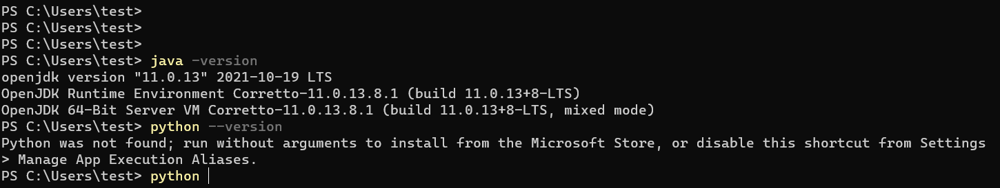
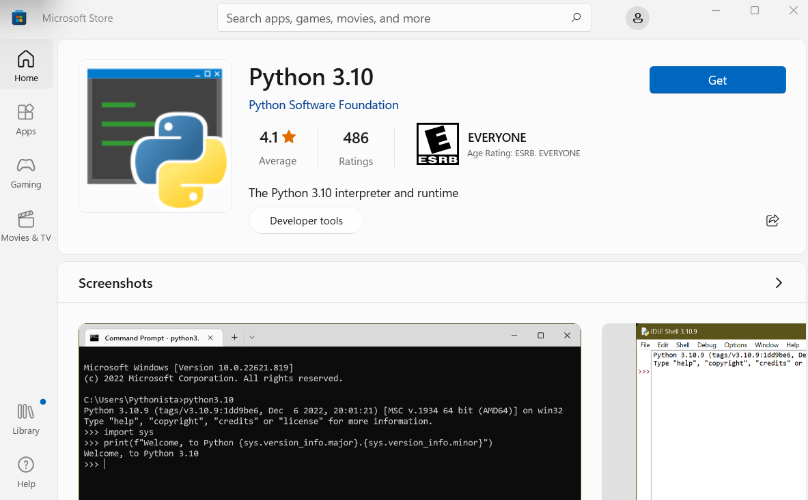
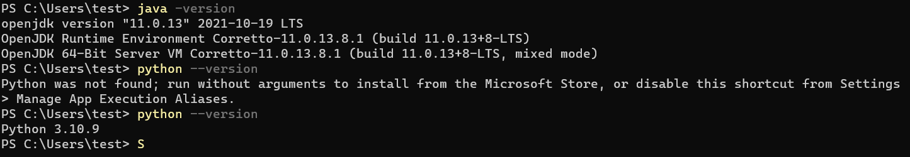
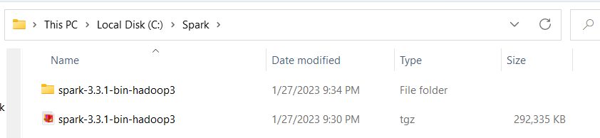
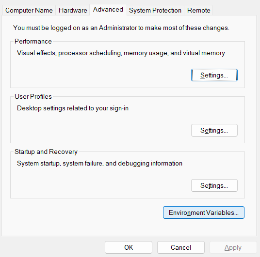

# 윈도우에서 Local Standalone Spark 클러스터 설치

- 윈도우 10+ 기반
- JDK11과 파이썬 3.8 혹은 그 이상을 설치

## 자바와 파이썬 설치 확인

```
java -version
python --version
```

자바의 경우 11이나 8이 설치되어 있으면 별도의 작업이 더 필요없음. 파이썬의 경우 설치가 안되어 있다면 그냥 python을 입력하고 윈도우를 통해 설치

<center></center>

위의 경우 자바는 11이 설치되어 있으나 파이썬은 설치되어 있지 않아서 python을 그냥 입력하면 아래와 같은 설치 프로그램이 뜨고 이를 통해 설치한다

<center></center>

설치 후에 다시 버전 체크 커멘트를 확인해본다

<center></center>
 
### JDK11 설치

자바가 설치되어 있지 않다면 아래 링크를 통해 설치

www.oracle.com/kr/java/technologies/javase-jdk11-downloads.html


## SPARK 3.0 설치

### 폴더 만들기 

C 드라이브의 루트밑에 Spark, Hadoop 이라는 폴더를 만들어 준다. 만일 다른 위치에 폴더들을 만든다면 잘 기억했다가 뒤에서 쓴다

- Spark: C:\Spark
- Hadoop: C:\Hadoop

### SPARK 3.0 다운로드

- https://spark.apache.org/downloads.html 방문 후 가장 최신 버전을 다운로드. 예에서는 3.5.3 

<center></center>

- 위의 파일을 C:\Spark으로 옮기고 압축해제를 한다.

<center></center>

### winutils.exe 다운로드 

- C:\Hadoop 밑에 bin 폴더를 만들고 아래 파일을 다운로드 받아 bin 폴더로 옮긴다
github.com/cdarlint/winutils/blob/master/hadoop-2.7.7/bin/winutils.exe

<center></center>


## 환경변수 설정

### SPARK_HOME, HADOOP_HOME, JAVA_HOME 설정

System에서 Advanced system settings 메뉴를 선택하고 아래 보이는 Environment Variables를 클릭한다

<center></center>

여기서 시스템 변수의 새로 만들기를 누르고 시스템 변수로 아래 환경 변수들을 설정한다. 

- HADOOP_HOME: C:\Hadoop
- SPARK_HOME:  C:\Spark\spark-3.5.3-bin-hadoop3
- JAVA_HOME: 위의 JDK가 설치된 디렉토리에 맞춰 지정

만일 자바가 설치된 폴더를 잘 모르겠으면 아래 커맨드를 실행해본다
```
C:>dir /b /s java.exe
```

### PATH 수정

다음으로 path에 다음 두 개를 추가한다

%SPARK_HOME%\bin
%HADOOP_HOME%\bin


## spark 프로그램 실행

spark-shell이나 pyspark을 실행하여 스칼라 기반 셀이나 파이썬 기반 셀을 띄울 수 있다. 또한 여기서 Spark Web UI의 위치를 찾아 브라우저에서 액세스볼 수 있다.

<center>

다음으로 C:\Spark 폴더 밑에서 spark-submit으로 pi.py를 실행한다

```
spark-submit --master local[4] ./spark-3.5.3-bin-hadoop3/examples/src/main/python/pi.py
```

<center></center>
